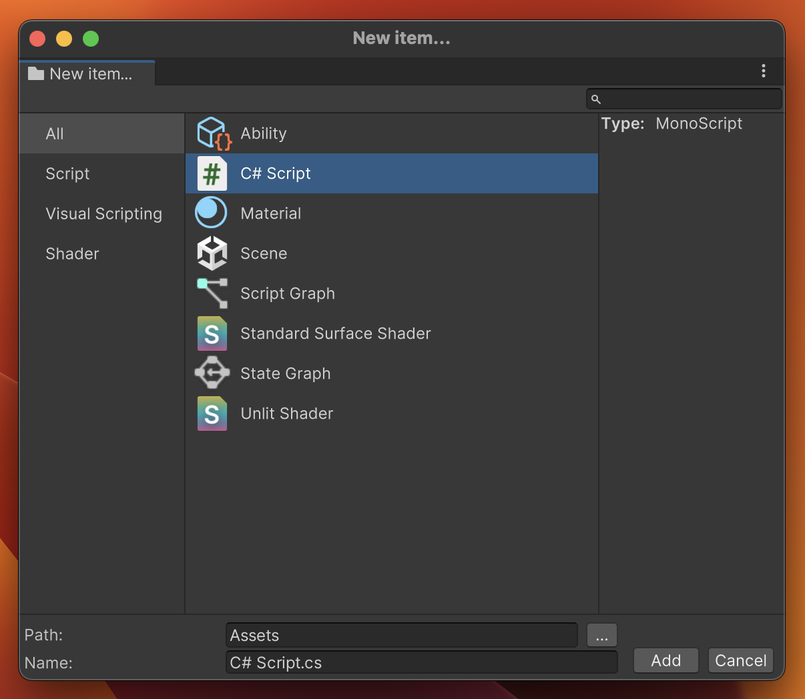

# Asset Factory

  

> Open from menu item: __Assets/Create/New Item...__

This is my attempt at introducing a better workflow for creating new assets.
This project is just a proof of concept.
I stopped the development when I realized that Unity API doesn't provide an easy way to create every kind of asset from code.

## Pitch

The variety of assets that you can create in a new Unity project is big and it is still expanding. Currently, to create new assets from the editor GUI Unity uses native menus. Menus with such a long list of items are becoming less and less easy to navigate.

I think that Unity would benefit from the new type of editor window whose main purpose is to create a new asset but also help in the item discoverability.
UI could look similar to the "New Item" window in Visual Studio.

The window would show 4 panes:
- Item category
- Item list
- Details
- File Location

### Item category
Shows a tree view of categories that the asset belongs to, like: C# Script, Visual Scripting, UI, Physics...
Because this is a tree view, categories could be nested:
- Code
    - Testing
    - Runtime
    - Editor
    - Shaders

### Item List
The item list would display all items from the selected category.

### Details
The details pane would show a short description of the selected item in the "Item List" pane.

Possible asset details that could be displayed:
UI Document:
- C# type name: VisualTreeAsset
- file extension: .uxml
- description: "(What is UI Document)"
- documentation link: Manual / Scripting reference links

### File Location
This pane allows you to enter:
- Directory name
- File name
- Create Asset
- Close the window

### Extendability
- User could open New Item Window from code with optional filters and options
  - Show only a,b and c items
  - x item can only be created in y directory
- The user could use C# API to add new entries to the New Item window.
- API should allow for adding multiple items just like `UnityEditor.SettingsProviderGroupAttribute`
- User could be able to configure asset with toggles and fields in details pane
  - Create Editor script for specific type
  - Create Assembly Definition Asset for testing/editor

## Benefits
- Better discoverability
    - assets
    - features and documentation (Thanks to the details pane)
- Built-in asset creation logic that could be integrated into project specific dev tools